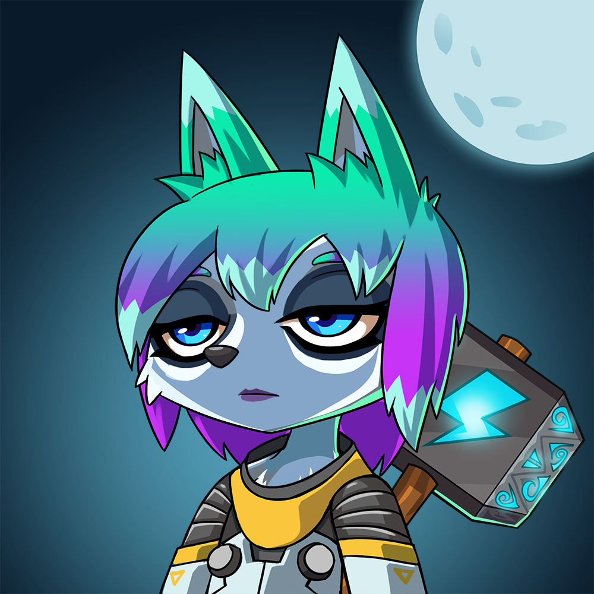

# 🦊Foxtopia | 🥩NFT Staking | ◎ Solana

<p align="center">
  <a href="https://metaplex.com">
    
  </a>
</p>

## Requirements
- Foxtopia
- Foxtopia Genesis
- Non-Custodial staking
## Development

```bash
npm run dev
# or
yarn dev
```
## Install

```bash
npm intall
# or
yarn [install]
```

## Set Configuration
```jsx
//mainnet-beta | devnet
export const NETWORK = "mainnet-beta";
//Solana RPC URL
export const SOLANA_RPC = "https://a2-mind-prd-api.azurewebsites.net/rpc";
// Solscan API URL for confirmation of transaction
export const SOLSCAN_API = "https://public-api.solscan.io/transaction/";
export const GLOBAL_AUTHORITY_SEED = "global-authority";

export const STAKING_PROGRAM_ID = new PublicKey("85SU7o78xMPtVVKPsVb4msfgw7foc3D4rtzTi9rSvqub");
export const FOXIE_TOKEN_MINT = new PublicKey("6Tf26EZ2F8efATQpodGKYMNMZccCTL1VPYzcC4kPF6cC");

// 60 * 60 * 24 = 1 day
export const EPOCH = 86400;
// lock time 10s
export const LOCKING_PERIOD = 10;

export const LIVE_URL = "https://foxtopiastaking.herokuapp.com/"
```